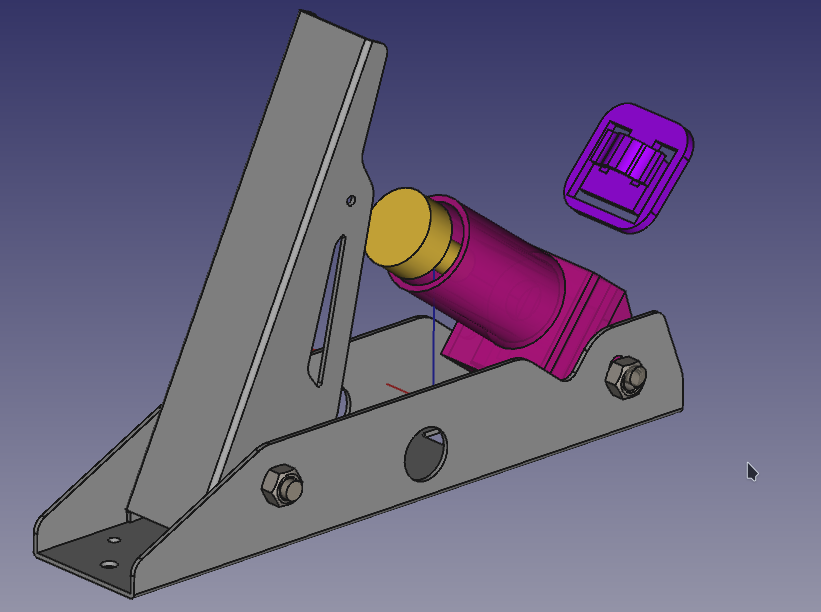
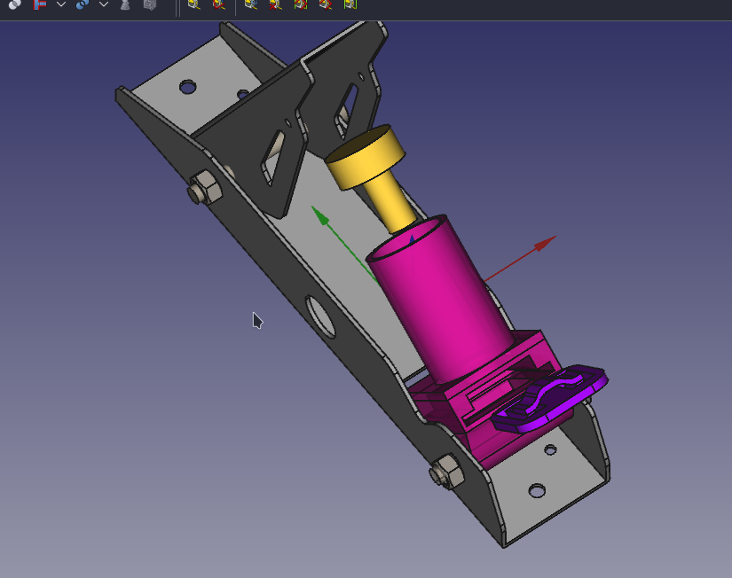
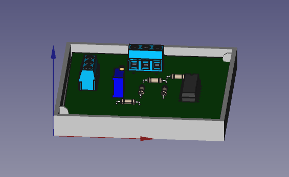
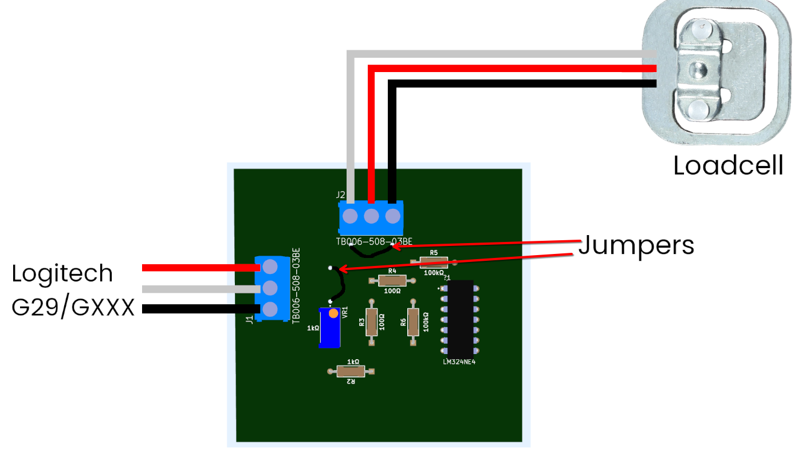

## Freio com célula de carga para o Logitech G29

Essa é uma proposta de uma loadcell simples e barata para o Logitech G29.

### Lista de materiais

| Quantidade  |              Componente              |
|-------------|--------------------------------------|
|    1        |  Circuito Integrado(AmpOP) LM324N    |
|    1        |  Resistor 1k Ohm                     |
|    2        |  Resistor 100k Ohm                   |
|    2        |  Resistor 100 Ohm                    |
|    1        |  Trimpot multivoltas 1k Ohm          |
|    1        |  Célula de Carga  de 3 fios          |
|    2        |  Borne parafusavel 3 pinos           |
|    1        |  Placa de circuito impresso 10x15cm  |
|    1        |  Caneta marcador permanente          |
|    1        |  Fios 1mm (vermelho, branco, preto)  |

### PCB

### Diagrama

