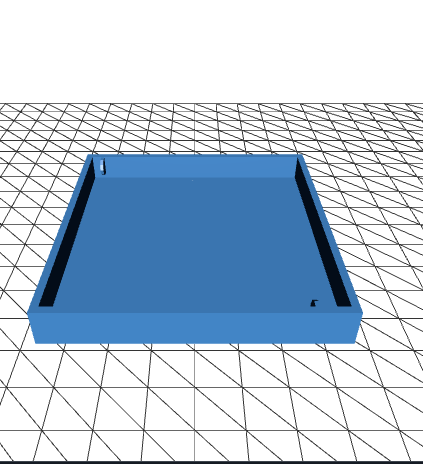

## Freio com célula de carga para o Logitech G29

Essa é uma proposta de uma loadcell simples e barata para o Logitech G29.

### Lista de materiais

| Quantidade  |              Componente              |
|-------------|--------------------------------------|
|    1        |  Circuito Integrado(AmpOP) LM324N    |
|    1        |  Resistor 1k Ohm                     |
|    2        |  Resistor 100k Ohm                   |
|    2        |  Resistor 100 Ohm                    |
|    1        |  Trimpot multivoltas 1k Ohm          |
|    1        |  Célula de Carga  de 3 fios          |
|    2        |  Borne parafusavel 3 pinos           |
|    1        |  Placa de circuito impresso 70x67mm  |
|    1        |  Caneta marcador permanente          |
|    1        |  Fios 1mm (vermelho, branco, preto)  |

#### Diagrama de Circuito

- 

#### PCB
A placa de circuito impresso deve ter as dimensões de 70x67mm.

- 

- 

- 

- 

### STLS
- [Suporte](https://github.com/moacirrf/g29loadcell/blob/main/stl/support-single.stl).

- 

- [Parte Interna](https://github.com/moacirrf/g29loadcell/blob/main/stl/internal.stl).

- 

- [Case para placa](https://github.com/moacirrf/g29loadcell/blob/main/stl/casePCB.stl).

- 

### Imagem Final

- 

